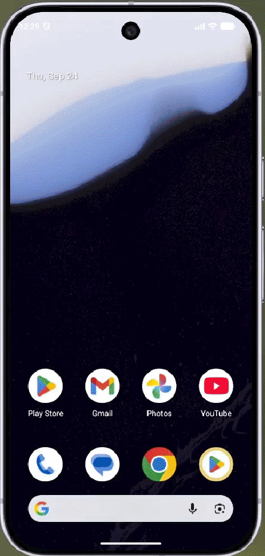

# Flutter-Mobile-Game

## Spaceship Survivor 
## A Mobile Game for Android and iOS made with Flutter / Flame Engine

### The purpose of this project is to practice and learn more about Flutter Architecture for Mobile Games, the Dart language, and the Flame Engine for the gameplay layer.

The implementation includes: 

- MVCS (https://pvha.hashnode.dev/mvcs-architecture) for the entire game screens, navigation, and components.
- Flame Engine usage on the core GamePlay (https://flame-engine.org/)
- Game conditions: Enemy/Player/Bullet Collision, Count Points, Life Damage, Pause, Save, Game Over during game session
- Sprite Animation (Player Spaceship, Enemies and Explosions)
- Service Locator (Dependency Injection) for the account layer (UserAccount) 
- Score Ranking saved on local disk (JSON file)
- Event-Driven approach between the game layer (Flame) and other widgets outside (Menu).
- Usage of Google Fonts API

